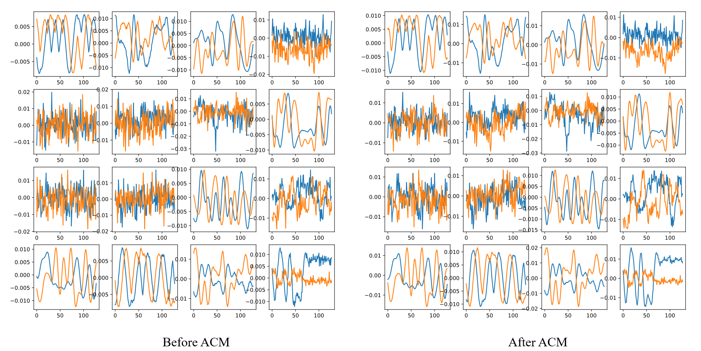
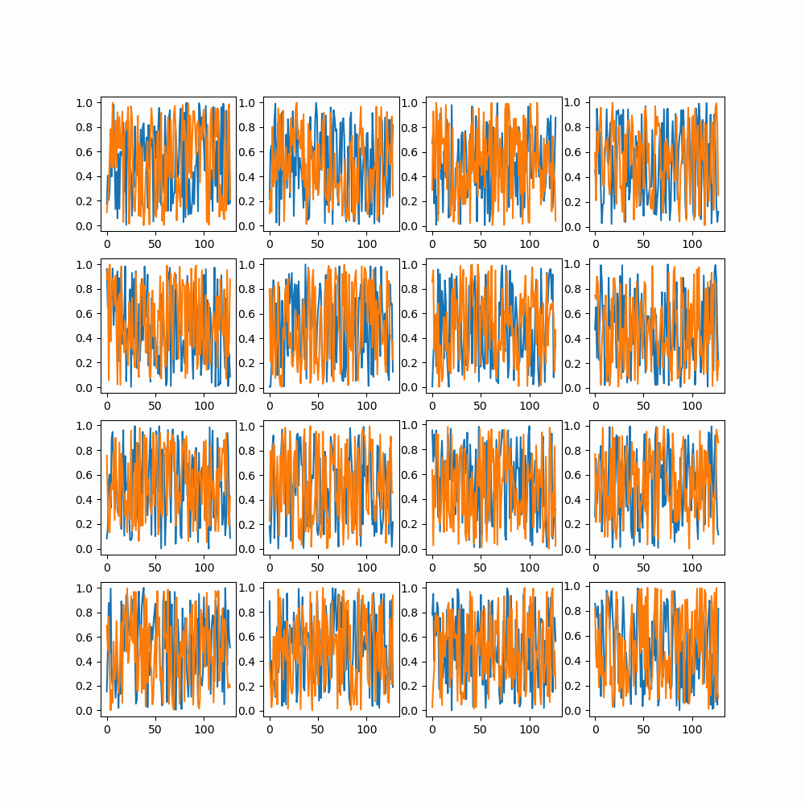

# AWN

**为响应[开放共享科研记录行动倡议(DCOX)](https://mmcheng.net/docx/)，本工作将提供中文文档，为华人学者科研提供便利。**

"AMC-Net： 一种用于自动调制分类的有效网络"开源代码。

张嘉伟，王天天，[冯志玺](https://faculty.xidian.edu.cn/FZX/zh_CN/index.htm)，[杨淑媛](https://web.xidian.edu.cn/syyang/)

西安电子科技大学

[[论文](https://arxiv.org/abs/2304.00445)] | [[中文文档](doc-CN/README.md)] | [[代码](https://github.com/zjwXDU/AMC-Net)] | [[海报](assets/poster.pdf)] | [[视频](assets/video.mp4)]


## 准备

### 数据准备

我们在RML2016.10a, RML2016.10b两个数据集上进行了实验：

| 数据集      | 类别                                                         | 样本数量     |
| ----------- | ------------------------------------------------------------ | ------------ |
| RML2016.10a | 8种数字调制：8PSK, BPSK, CPFSK, GFSK, PAM4, 16QAM, 64QAM, QPSK；3种模拟调制：AM-DSB，AM-SSB，WBFM | 22万(2×128)  |
| RML2016.10b | 8种数字调制：8PSK, BPSK, CPFSK, GFSK, PAM4, 16QAM, 64QAM, QPSK；3种模拟调制：AM-DSB，WBFM | 120万(2×128) |

数据集可以从[DeepSig](https://www.deepsig.ai/)网站下载。请将下载后得到的压缩包直接解压入`./data`目录，并保持文件名不变。最后的`./data`目录结构如下所示：

```
data
├── RML2016.10a_dict.pkl
└── RML2016.10b.dat
```

### 预训练模型

我们提供了在两个数据集上的预训练模型，你可以从[Google Drive](https://drive.google.com/file/d/18RyUp-qnACE1zvmVOSjiF1jhWms0eB0Z/view?usp=share_link)或者[百度网盘](https://pan.baidu.com/s/1aKlM_rj8wLYrFHXxyh8PBQ?pwd=pnxv)中下载。请将下载得到的压缩文件直接解压入`./checkpoint`中。

### 环境配置

- Python >= 3.6
- PyTorch >=1.7

这一版本的代码测试于Pytorch==1.8.1。

## 训练&评估

整个流程是从我们的另一个工作 [AWN](https://github.com/zjwXDU/AWN) 中采用的。您可以在那里找到有关训练和评估的详细信息。

## 可视化



我们提供了一种额外的模式，可以可视化 ACM 之前和 ACM 之后的信号，您可以使用以下命令调用：

```
python main.py --mode visualize --dataset <DATASET>
```

与*评估*时类似，绘制的图像以`.svg`的形式储存在`./result`下。

令人惊讶的是，如果我们输入一批随机噪声，并使用 ACM 自回归地进行处理：



它的行为看起来像某种隐式生成模型。这种特性可能有助于实现在线数据增强。

## 开源许可证

本代码许可证为[MIT LICENSE](https://github.com/zjwXDU/AMC-Net/blob/main/LICENSE). 注意！我们的代码依赖于一些拥有各自许可证的第三方库和数据集，你需要遵守对应的许可证协议。

## 引文

如果您觉得我们的工作对您的研究有帮助，请考虑引用我们的论文：

```
@misc{zhang2023amcnet,
      title={AMC-Net: An Effective Network for Automatic Modulation Classification}, 
      author={Jiawei Zhang and Tiantian Wang and Zhixi Feng and Shuyuan Yang},
      year={2023},
      eprint={2304.00445},
      archivePrefix={arXiv},
      primaryClass={eess.SP}
}
```

联系方式：zjw AT stu DOT xidian DOT edu DOT cn
